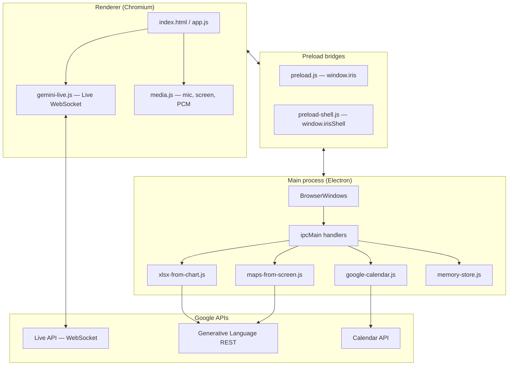

# Iris

Desktop voice + screen assistant powered by **[Google Gemini Multimodal Live](https://ai.google.dev/gemini-api/docs/multimodal-live)**. Talk naturally; Iris answers with speech and text, and can use periodic screen captures so replies match what you’re looking at.

---

## Architecture

High-level flow:



**Windows**

| Window | Purpose |
|--------|---------|
| **Main** | Session controls, transcript, composer (typed messages to Live), screen preview, theme toggle, welcome screen on first paint. |
| **Overlay** | Full-screen transparent layer: draw **focus regions**, passthrough when done, per-region **dismiss (×)**; rects map to **focus grounding** text for the model. |
| **Focus bar** | Shown when the main window is **minimized** during a live session: stop share, observation mode, **Add focus** / **Done**, **Type** composer, and a **dock** for downloads & links (same actions as the main panel). |

**Rough data path:** one **Live** session handles audio + tool calls; **JPEG** frames (~1 fps) go to the model for screen context; **tool** calls (export, Maps, Calendar) are handled in the main process and results show in the transcript (and focus bar dock when it’s open). IPC wiring lives in `main.js`, `preload.js`, and `preload-shell.js`.

---

## Stack

| Area | Notes |
|------|--------|
| **App shell** | Electron 34, `contextIsolation`, separate preloads for main vs overlay/focus-bar |
| **Live model** | `gemini-3.1-flash-live-preview` over WebSocket (`BidiGenerateContent`) |
| **Audio** | Web Audio + **worklets** for capture/playback paths (`renderer/audio-processors/`) |
| **Screen** | `getDisplayMedia` / `desktopCapturer`; optional focus rectangles baked into sent frames |
| **Exports** | REST JSON extraction from a frame → `.xlsx` (SheetJS) or `.txt` (`xlsx-from-chart.js`) |
| **Maps** | Frame + hint → URL (`maps-from-screen.js`) |
| **Calendar** | OAuth + Calendar API (`googleapis`, `google-calendar.js`) |
| **Memory** | Local turns + optional consolidation (`memory-store.js`) |
| **UI** | Vanilla HTML/CSS/JS |

---

## Project layout (main pieces)

```
Project_Iris/
├── main.js                 # Windows, IPC, exports, Maps, Calendar
├── preload.js / preload-shell.js
├── google-calendar.js
├── memory-store.js
├── maps-from-screen.js
├── xlsx-from-chart.js
└── renderer/
    ├── index.html, app.js, styles.css
    ├── focus-bar.*           # Compact bar + composer + dock
    ├── overlay-focus.*       # Focus regions overlay
    └── lib/                  # gemini-live, media, prompts, tools
```

---

## Requirements

- **Node.js** (LTS recommended)
- **Gemini API key** with Live access ([Google AI Studio](https://aistudio.google.com/apikey))
- Microphone; OS permission to **share screen** when you use it

---

## Quick start

```bash
git clone <your-repo-url>
cd Project_Iris
npm install
```

Copy `.env.example` to `.env`:

```env
GEMINI_API_KEY=your_key_here
```

Run:

```bash
npm start
```

First run: **Get started** → **Start session** → **Share screen** when you want screen context. Optional env vars (export/memory models, Maps, OAuth) are described in **`.env.example`**.

---

## Features (checklist)

| Feature | What it is |
|---------|------------|
| **Voice session** | Bidirectional audio with Gemini Live; live / connecting / idle status |
| **Transcript** | User + Iris text; pending streaming bubbles |
| **Typed input** | Composer under **Conversation** (and on the **focus bar** when minimized) — e.g. Google email for Calendar |
| **Screen share** | Pick display or window; in-app preview; frames sent to the model |
| **Observation mode** | **Silent** (speak when you engage) vs **Ambient** (brief notes on big screen changes) — set **before** starting; changing it needs a **new session** |
| **Focus regions** | **Add focus** → draw rects on overlay → **Done** → numbered regions + grounding for the model; **×** on each region to remove |
| **Stop / session end** | Stops mic, capture, Live, clears overlay and focus bar dock |
| **Exports** | Tools: **Excel (.xlsx)** from charts/tables on screen, **.txt** from visible text — download in transcript + dock |
| **Google Maps link** | Tool: build an **openable Maps URL** from what’s visible (+ optional hint / focus region) |
| **Google Calendar** | Optional: create events via OAuth (see below); email in composer |
| **Long-term memory** | Session notes consolidated over time (local storage under app user data) |
| **Themes** | Dark / light (welcome + main window) |
| **Welcome screen** | Onboarding hero; opaque layer so it doesn’t show the main UI underneath |

---

## Google Calendar (optional)

1. In [Google Cloud Console](https://console.cloud.google.com/), enable **Google Calendar API** and create an **OAuth client ID** (type **Desktop**).  
2. Consent screen: Calendar + **userinfo.email**; redirect **`http://127.0.0.1:45231/oauth2callback`** (or match `GOOGLE_OAUTH_REDIRECT_URI` in `.env` and in Console).  
3. Set `GOOGLE_OAUTH_CLIENT_ID` and `GOOGLE_OAUTH_CLIENT_SECRET` in `.env` (see `.env.example`).  

If OAuth is in **Testing**, add your Google account under **Test users**. For **“App isn’t verified”**, use **Advanced → continue**.

---

## Security

- Don’t commit **`.env`**. Treat API keys and OAuth secrets like production secrets.  
- Don’t distribute a build that bakes in your key for untrusted users.  
- Calendar tokens are stored under Electron’s user data path (OS **safeStorage** when available).
